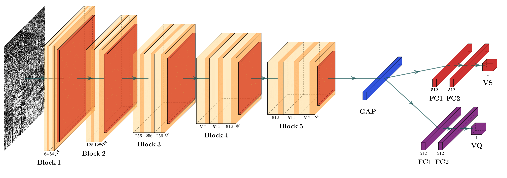

# MultiTask Visual Metric

In this work, we propose a non reference CNN-based image quality and visual security metric for perceptually encrypted images

## Dataset

> IVC-SelectEncrypt

The IVC-SelectEncrypt database provides 200 encrypted images from 8 reference gray-scale images of size 720 × 480, encrypted with 5 different encryption schemes at 5 levels of security. 

> Perceptually Encrypted Image Database (PEID)

The PEID database contains 20 reference gray-scale images of size 512 × 512, encrypted using 10 different encryption schemes at 4 to 6 level of perceptually encrypted images, resulting in a total of 1080 encrypted images.

## Purpose: 

Image Quality and Visual Security Assessment ( using non reference mode ) 

## Preprocessing-data

> Split into patches

First, we divide all images into Np (4 in our case) small patches of size 256 × 256 without overlapping and then resize them to 224 × 224

> Patch labelling

we design a labeling algorithm to automatically assign to each sampled patch the score of the encrypted image

## Model

### Environment

We conduct all of our experiments using the open-source library Keras, Tensorflow as backend, and performed it on Google Colab. 
 
### Training

Our model is trained, for each database, on the 80%. 
During the model training phase, each mini-batch contained 64 patches derived from 16 images, and each image is represented by 4 patches. The MSE loss function and a learning rate η equal to 0.0001 are used for the Adam optimizer. A dropout regularization is added to all FC layers with probability 0.2 to prevent overfitting. 
The model is trained by backpropagation over several sets of epochs 500 with the EarlyStopping technique to address the overfitting problem.

### Testing

The model is tested on the remaining 20% of each database.
> Visual Quality Assessment Test Result on PEID Data Set

> Visual Security Assessment Test Result on PEID Data Set

